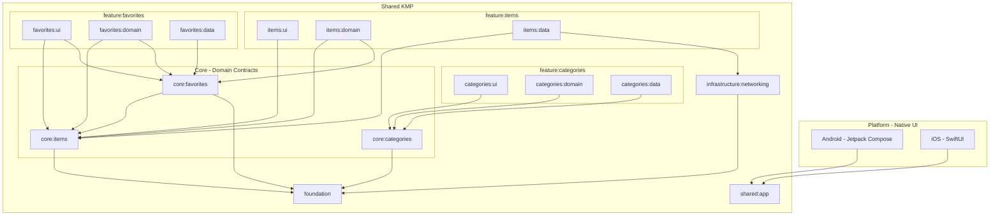
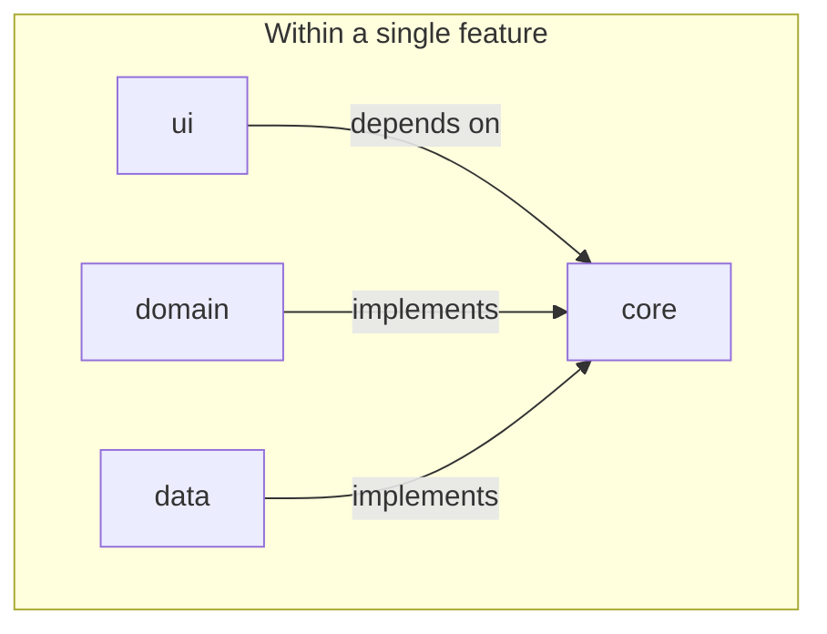
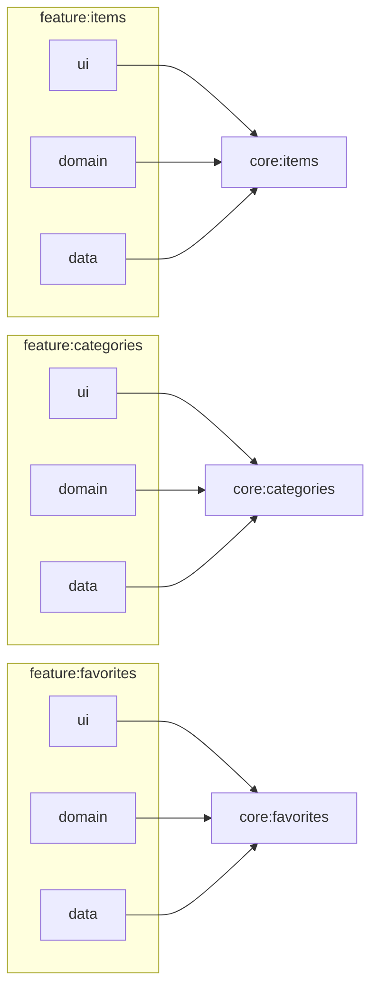
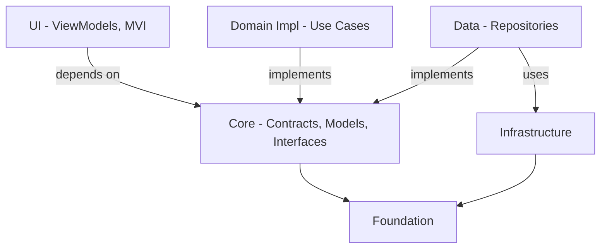
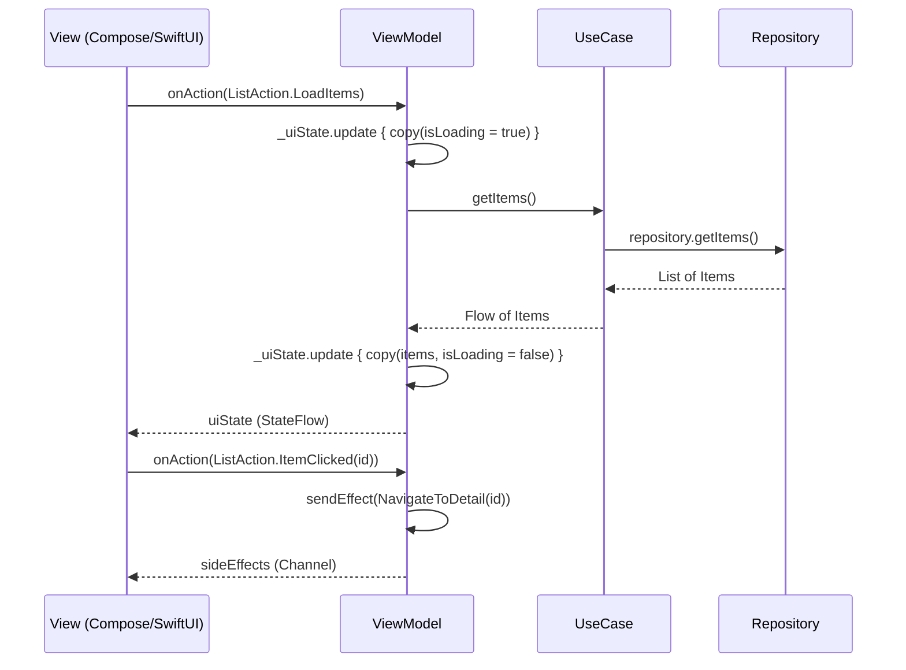
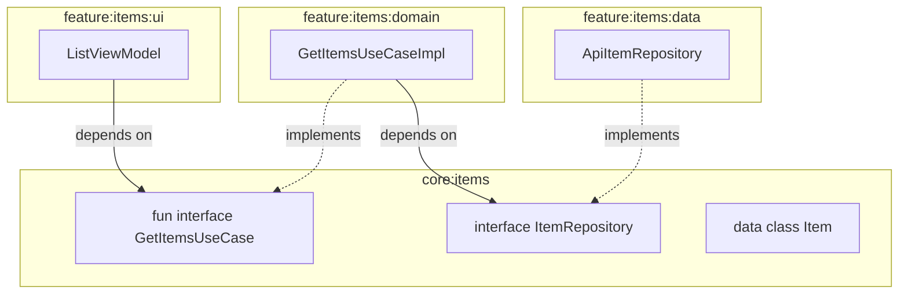
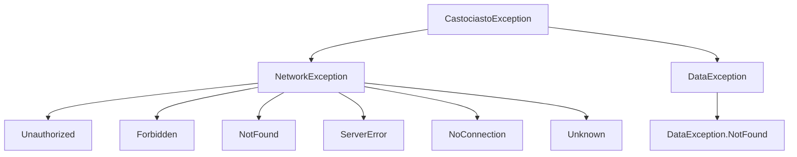
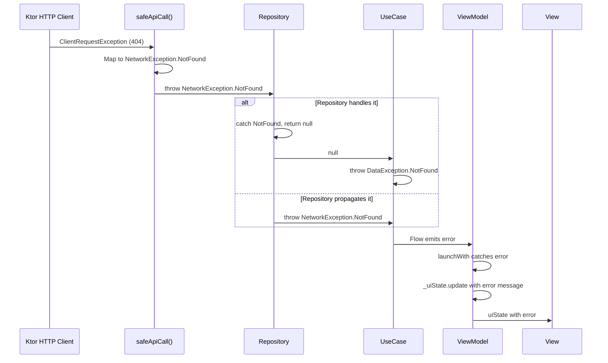
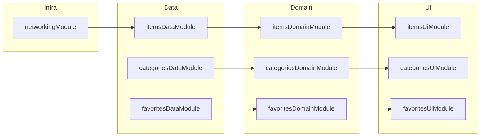
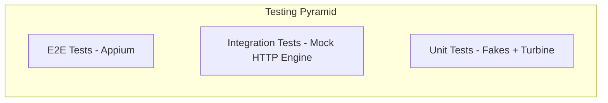

# Castociasto

A **Kotlin Multiplatform** (KMP) project implementing **Clean Architecture** with **MVI** pattern, targeting Android and iOS with fully shared business logic and native UI.

## Table of Contents

- [Architecture Overview](#architecture-overview)
- [Module Structure](#module-structure)
- [Dependency Flow](#dependency-flow)
- [Feature Isolation](#feature-isolation)
- [Clean Architecture Layers](#clean-architecture-layers)
- [MVI Pattern](#mvi-pattern)
- [SOLID Principles](#solid-principles)
- [Dependency Inversion](#dependency-inversion)
- [Exception Handling](#exception-handling)
- [Dependency Injection](#dependency-injection)
- [Build Convention Plugins](#build-convention-plugins)
- [Testing Strategy](#testing-strategy)
- [Tech Stack](#tech-stack)

---

## Architecture Overview



---

## Module Structure

```
Castociasto/
├── androidApp/                          # Android app (Jetpack Compose)
├── iosApp/                              # iOS app (SwiftUI)
├── build-logic/convention/              # Custom Gradle plugins for layer enforcement
├── e2e/                                 # Appium E2E tests
└── shared/
    ├── app/                             # DI aggregation + iOS framework export
    ├── foundation/                      # Base types: BaseViewModel, exceptions, extensions
    ├── infrastructure/
    │   └── networking/                  # Ktor HTTP client, safeApiCall, JSON config
    ├── core/                            # Domain contracts (interfaces + models, no implementations)
    │   ├── items/                       # ItemRepository, GetItemsUseCase, Item model
    │   ├── categories/                  # CategoryRepository, GetCategoriesUseCase, Category model
    │   └── favorites/                   # FavoriteRepository, ToggleFavoriteUseCase (depends on core:items)
    └── feature/                         # Implementations (domain/data/ui per feature, fully isolated)
        ├── items/
        │   ├── domain/                  # GetItemsUseCaseImpl, GetItemUseCaseImpl
        │   ├── data/                    # ApiItemRepository (Ktor HTTP)
        │   └── ui/                      # ListViewModel, DetailViewModel, MVI contracts
        ├── categories/
        │   ├── domain/                  # GetCategoriesUseCaseImpl
        │   ├── data/                    # FakeCategoryRepository (in-memory)
        │   └── ui/                      # CategoriesViewModel
        └── favorites/
            ├── domain/                  # ToggleFavoriteUseCaseImpl
            ├── data/                    # FakeFavoriteRepository (in-memory)
            └── ui/                      # FavoritesViewModel
```

---

## Dependency Flow

Within each feature, **UI, Domain, and Data are independent siblings**. They all depend on Core (domain contracts) but **never on each other**:



This is the key architectural rule — **the dependency arrows from UI and Data both point inward toward Core**:

- `ui` depends on Core to read use case interfaces and models
- `domain` depends on Core to implement use case interfaces (using repository interfaces)
- `data` depends on Core to implement repository interfaces

**UI never knows about Data. Data never knows about UI. Neither knows about Domain implementations.** They are wired together only at runtime through Koin DI.

---

## Feature Isolation

Feature modules **cannot depend on other feature modules**. Each feature is a self-contained vertical slice with its own `ui`, `domain`, and `data` layers.



When features need to share concepts (e.g., the favorites feature needs the `Item` model from items), they communicate through **Core modules** — never through each other's implementations. For example, `core:favorites` depends on `core:items`, and `favorites:domain` depends on both `core:favorites` and `core:items`.

---

## Clean Architecture Layers

The **Core** layer is the independent center. It defines all contracts, models, and use case signatures. Everything else depends on it — it depends on nothing (except Foundation base types).



| Layer | Module | Role | Depends On |
|-------|--------|------|------------|
| **Core** | `shared/core/*` | Defines interfaces, models, use case signatures. Owns the domain. | Foundation |
| **Domain Impl** | `shared/feature/*/domain` | Implements use case interfaces from Core | Core, Foundation |
| **Data** | `shared/feature/*/data` | Implements repository interfaces from Core | Core, Infrastructure |
| **UI** | `shared/feature/*/ui` | Consumes use case interfaces from Core via ViewModels | Core, Foundation |
| **Infrastructure** | `shared/infrastructure/networking` | HTTP client, error mapping, serialization | Foundation |
| **Foundation** | `shared/foundation` | BaseViewModel, exception hierarchy, flow extensions | — |

---

## MVI Pattern

Each screen follows the **Model-View-Intent** pattern with an explicit contract.



### MVI Contract Structure

Every screen defines a **triple** of `State`, `Action`, and `SideEffect`:

```kotlin
// State — the current UI state (immutable data class)
data class ListState(
    val items: List<Item> = emptyList(),
    val isLoading: Boolean = false,
    val error: String? = null,
)

// Action — user intents (sealed interface)
sealed interface ListAction {
    data object LoadItems : ListAction
    data class ItemClicked(val itemId: String) : ListAction
}

// SideEffect — one-shot events like navigation (sealed interface)
sealed interface ListSideEffect {
    data class NavigateToDetail(val itemId: String) : ListSideEffect
}
```

### BaseViewModel

All ViewModels extend `BaseViewModel<State, Action, SideEffect>`:

```kotlin
abstract class BaseViewModel<S : Any, A, E> : ViewModel() {
    protected abstract val _uiState: MutableStateFlow<S>
    val uiState: StateFlow<S>          // Observed by the View
    val sideEffects: Flow<E>           // Collected by the View for navigation/effects
    abstract fun onAction(action: A)   // Single entry point for all user intents
    protected fun sendEffect(effect: E)
}
```

This ensures **unidirectional data flow**: View dispatches Actions, ViewModel produces State and SideEffects.

---

## SOLID Principles

### Single Responsibility (SRP)

Each module and class has exactly one reason to change:

| Class | Single Responsibility |
|-------|----------------------|
| `GetItemsUseCaseImpl` | Fetches and sorts items |
| `GetItemUseCaseImpl` | Combines item data with favorite status |
| `ApiItemRepository` | HTTP communication for items |
| `ListViewModel` | Manages list screen MVI state machine |
| `safeApiCall` | Maps HTTP exceptions to domain exceptions |

### Open/Closed Principle (OCP)

- New features are added by creating new modules — no existing code is modified
- The `CastociastoException` sealed hierarchy is extensible with new exception categories
- New use cases implement existing `fun interface` contracts without changing consumers

### Liskov Substitution (LSP)

- `FakeCategoryRepository` and `FakeFavoriteRepository` are drop-in substitutes for real implementations
- Test fakes (`FakeItemRepository`) substitute production repositories without behavioral differences
- All repository implementations honor the contracts defined in `core` interfaces

### Interface Segregation (ISP)

- Use cases are defined as **single-method functional interfaces** (`fun interface`):
  ```kotlin
  fun interface GetItemsUseCase {
      operator fun invoke(): Flow<List<Item>>
  }
  ```
- Repositories expose only the methods needed by their consumers
- Core modules contain only interfaces and models — no implementation baggage

### Dependency Inversion (DIP)

All outer layers (UI, Domain Impl, Data) depend on **abstractions defined in Core**. Core never depends on implementations. See the [Dependency Inversion](#dependency-inversion) section for details.

---

## Dependency Inversion

Core defines contracts. UI, Domain, and Data all implement or consume those contracts. None of them know about each other — only about Core.



### How it works in practice

1. **Core** defines the contracts (interfaces + models):
   ```kotlin
   // shared/core/items — no implementation, no Koin, no Ktor
   interface ItemRepository {
       suspend fun getItems(): List<Item>
       suspend fun getItem(id: String): Item?
   }
   ```

2. **Data** implements the repository interface from Core:
   ```kotlin
   // shared/feature/items/data — implements the core interface
   internal class ApiItemRepository(
       private val httpClient: HttpClient,
   ) : ItemRepository { ... }
   ```

3. **Domain** implements the use case interface from Core, depending on the repository interface (not implementation):
   ```kotlin
   // shared/feature/items/domain — depends only on interfaces from core
   internal class GetItemsUseCaseImpl(
       private val repository: ItemRepository,  // interface from core
   ) : GetItemsUseCase { ... }
   ```

4. **UI** depends on the use case interface from Core (not the implementation):
   ```kotlin
   // shared/feature/items/ui — depends only on interfaces from core
   class ListViewModel(
       private val getItems: GetItemsUseCase,  // interface from core
   ) : BaseViewModel<ListState, ListAction, ListSideEffect>() { ... }
   ```

5. **Koin** wires it all together at runtime:
   ```kotlin
   val itemsDataModule = module {
       single<ItemRepository> { ApiItemRepository(get()) }
   }
   val itemsDomainModule = module {
       factory<GetItemsUseCase> { GetItemsUseCaseImpl(get()) }
   }
   val itemsUiModule = module {
       viewModelOf(::ListViewModel)
   }
   ```

6. **Gradle plugins** enforce these boundaries at compile time — `ui` cannot import `data`, `domain` cannot import `data`, `core` cannot import Koin or Ktor.

---

## Exception Handling

Errors are modeled as a **sealed exception hierarchy** that flows from the infrastructure layer up through domain to the UI.



### Error Flow Through Layers



### Layer-by-layer error handling

**1. Infrastructure** — `safeApiCall()` maps all HTTP/network errors to typed domain exceptions:
```kotlin
suspend fun <T> safeApiCall(block: suspend () -> T): T {
    return try { block() }
    catch (e: CancellationException) { throw e }          // Never swallow cancellation
    catch (e: CastociastoException) { throw e }            // Already typed — re-throw
    catch (e: ClientRequestException) {                     // HTTP 4xx
        throw when (e.response.status.value) {
            401 -> NetworkException.Unauthorized
            403 -> NetworkException.Forbidden
            404 -> NetworkException.NotFound
            else -> NetworkException.Unknown(e.message)
        }
    }
    catch (e: ServerResponseException) { throw NetworkException.ServerError(e.message) }
    catch (e: Exception) { throw NetworkException.NoConnection(e.message ?: "Connection failed") }
}
```

**2. Data** — Repositories call `safeApiCall()` and may handle specific exceptions:
```kotlin
override suspend fun getItem(id: String): Item? = try {
    safeApiCall { httpClient.get("posts/$id").body<PostDto>().toItem() }
} catch (e: CastociastoException.NetworkException.NotFound) {
    null  // 404 is expected — return null
}
```

**3. Domain** — Use cases may throw new domain exceptions:
```kotlin
val item = itemRepository.getItem(id)
    ?: throw CastociastoException.DataException.NotFound("Item $id not found")
```

**4. UI** — ViewModels catch errors via `launchWith()` extension and map to UI state:
```kotlin
getItems()
    .onStart { _uiState.update { it.copy(isLoading = true) } }
    .onEach { items -> _uiState.update { it.copy(items = items, isLoading = false) } }
    .launchWith(viewModelScope) { error ->
        _uiState.update { it.copy(isLoading = false, error = error.message) }
    }
```

---

## Dependency Injection

**Koin** is used as the DI framework. Each layer registers its own module. Koin is the only place where implementations are linked to interfaces — the rest of the code only knows about abstractions.



All modules are aggregated in `shared/app`:
```kotlin
val appModules = listOf(
    networkingModule,
    itemsDataModule, itemsDomainModule, itemsUiModule,
    categoriesDataModule, categoriesDomainModule, categoriesUiModule,
    favoritesDataModule, favoritesDomainModule, favoritesUiModule,
)
```

---

## Build Convention Plugins

Custom Gradle plugins in `build-logic/convention/` enforce architectural boundaries at compile time. Each layer gets only the dependencies it needs — nothing more.

| Plugin | Applied To | Provides | Restricts |
|--------|-----------|----------|-----------|
| `castociasto.kmp.library` | All shared modules | KMP base setup | No framework dependencies |
| `castociasto.kmp.api` | `core/*` | Coroutines | No Koin, no Ktor, no Lifecycle |
| `castociasto.kmp.domain` | `feature/*/domain` | Coroutines, Koin | No Ktor, no Lifecycle |
| `castociasto.kmp.data` | `feature/*/data` | Coroutines, Koin | No Lifecycle |
| `castociasto.kmp.ui` | `feature/*/ui` | Coroutines, Koin, Lifecycle, ViewModel | — |
| `castociasto.kmp.infra` | `infrastructure/*` | Ktor, Serialization, Koin | No Lifecycle |

This means a `core` module **physically cannot** import Koin or Ktor — the dependency simply isn't on the classpath. A `domain` module cannot import Ktor. These boundaries are enforced by the build system, not by convention.

---

## Testing Strategy



| Layer | Test Type | Approach |
|-------|-----------|----------|
| **Domain** | Unit tests | Fake repositories, Turbine for Flow assertions |
| **Data** | Integration tests | Ktor `MockEngine` for HTTP response simulation |
| **UI** | ViewModel tests | Fake use cases, MVI state/effect assertions |
| **E2E** | End-to-end | Appium tests on real devices |

---

## Tech Stack

| Category | Technology |
|----------|-----------|
| **Language** | Kotlin 2.x (Multiplatform) |
| **Android UI** | Jetpack Compose |
| **iOS UI** | SwiftUI |
| **Architecture** | Clean Architecture + MVI |
| **Networking** | Ktor |
| **Serialization** | kotlinx.serialization |
| **DI** | Koin |
| **Async** | Kotlin Coroutines + Flow |
| **ViewModel** | AndroidX Lifecycle (multiplatform) |
| **Testing** | kotlin.test, Turbine, Ktor MockEngine |
| **E2E Testing** | Appium |
| **Build** | Gradle with convention plugins |
