# Castociasto

A **Kotlin Multiplatform** (KMP) reference project demonstrating **Clean Architecture** with **MVI** pattern, targeting Android and iOS with fully shared business logic and native UI.

This project serves as a **best practices template** for building production-grade KMP apps. Every architectural decision — module boundaries enforced at compile time, strict dependency inversion, sealed exception hierarchy, offline-first data sync, cross-feature event bus — is intentional and documented below.

## Table of Contents

- [Architecture Overview](#architecture-overview)
- [Module Structure](#module-structure)
- [Dependency Flow](#dependency-flow)
- [Feature Isolation](#feature-isolation)
- [Clean Architecture Layers](#clean-architecture-layers)
- [Event Bus](#event-bus)
- [Database + API Sync](#database--api-sync)
- [Observable vs One-Shot Use Cases](#observable-vs-one-shot-use-cases)
- [MVI Pattern](#mvi-pattern)
- [SOLID Principles](#solid-principles)
- [Dependency Inversion](#dependency-inversion)
- [Exception Handling](#exception-handling)
- [Dependency Injection](#dependency-injection)
- [Build Convention Plugins](#build-convention-plugins)
- [Testing Strategy](#testing-strategy)
- [Appium vs Maestro Comparison](#appium-vs-maestro-comparison)
- [How to Add a New Feature](#how-to-add-a-new-feature)
- [Getting Started](#getting-started)
- [Tech Stack](#tech-stack)

---

## Architecture Overview

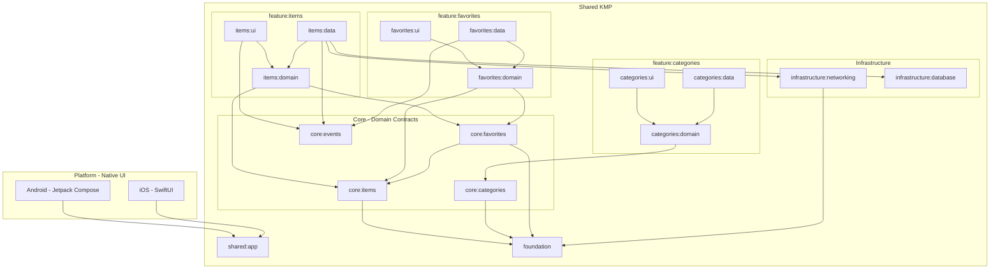

---

## Module Structure

```
Castociasto/
├── androidApp/                          # Android app (Jetpack Compose)
├── iosApp/                              # iOS app (SwiftUI)
├── build-logic/convention/              # Custom Gradle plugins for layer enforcement
├── e2e/                                 # Appium E2E tests (Kotlin + Page Objects)
├── .maestro/                            # Maestro E2E flows (YAML, zero setup)
└── shared/
    ├── app/                             # DI aggregation + iOS framework export
    ├── foundation/                      # Base types: BaseViewModel, exceptions, extensions
    ├── infrastructure/
    │   ├── networking/                  # Ktor HTTP client, safeApiCall, JSON config
    │   └── database/                   # Room database, DAOs, entities
    ├── core/                            # Shared models + cross-feature contracts
    │   ├── items/                       # Item model, ItemRepository interface
    │   ├── categories/                  # Category model, CategoryRepository interface
    │   ├── favorites/                   # FavoriteRepository interface (depends on core:items)
    │   └── events/                     # AppEvent, AppEventBus (cross-feature communication)
    └── feature/                         # Features (domain/data/ui per feature, fully isolated)
        ├── items/
        │   ├── domain/                  # GetItems, ObserveItems, RefreshItems use cases
        │   ├── data/                    # OfflineFirstItemRepository (Room + Ktor)
        │   └── ui/                      # ListViewModel, DetailViewModel, MVI contracts
        ├── categories/
        │   ├── domain/                  # GetCategoriesUseCase + implementation
        │   ├── data/                    # FakeCategoryRepository (in-memory)
        │   └── ui/                      # CategoriesViewModel
        └── favorites/
            ├── domain/                  # GetFavoritesUseCase, ToggleFavoriteUseCase + implementations
            ├── data/                    # FakeFavoriteRepository (in-memory, emits events)
            └── ui/                      # FavoritesViewModel
```

---

## Dependency Flow

Within each feature, **UI and Data both depend on Domain**. Domain is the center — it owns use case interfaces and contracts. Core provides shared models and cross-feature repository interfaces.

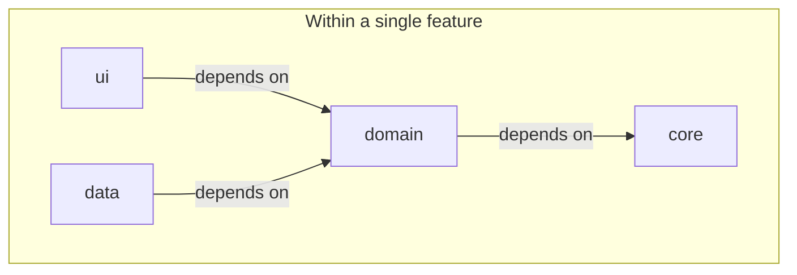

This is the key architectural rule — **UI -> Domain <- Data**:

- `ui` depends on Domain for use case interfaces (and Core for shared models)
- `data` depends on Domain for repository contracts (and Core for shared models)
- `domain` owns use case interfaces and depends on Core for models and cross-feature repository interfaces

**UI never knows about Data. Data never knows about UI.** They are wired together only at runtime through Koin DI.

---

## Feature Isolation

Feature modules **cannot depend on other feature modules**. Each feature is a self-contained vertical slice with its own `ui`, `domain`, and `data` layers.

**Within a single feature** — UI and Data both point to Domain:

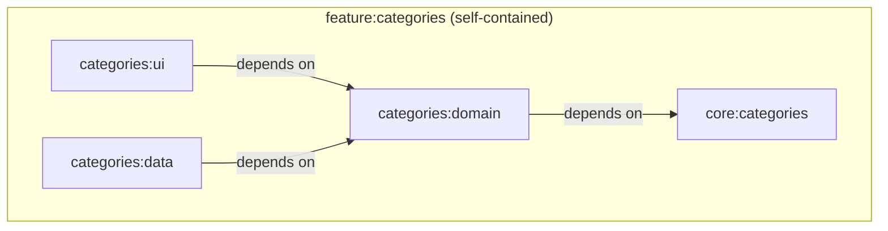

**Cross-feature communication** — features never depend on each other directly. When `favorites` needs the `Item` model or `ItemRepository` from items, it goes through Core. For runtime events, features communicate through the **Event Bus** (`core:events`):

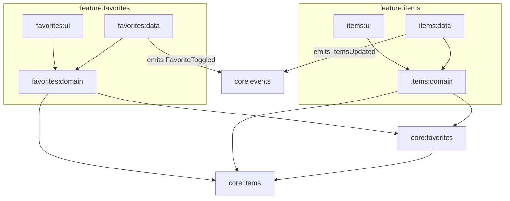

Features share concepts through **Core modules** — never through each other's domain, data, or ui implementations.

---

## Clean Architecture Layers

**Domain** is the center of each feature. It owns use case interfaces and implementations. UI and Data both depend on Domain. Core provides shared models and repository interfaces.

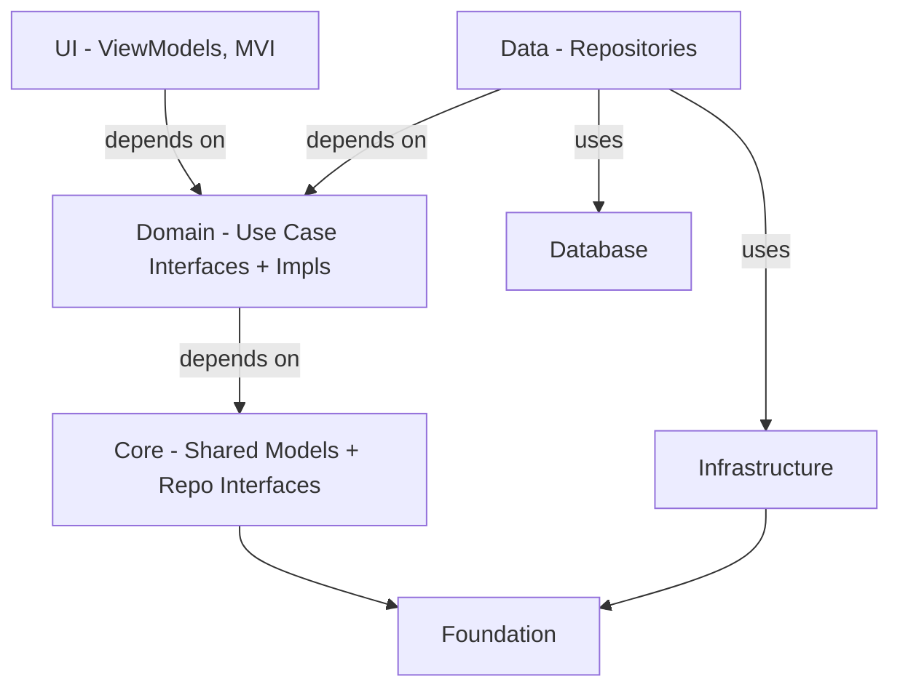

| Layer | Module | Role | Depends On |
|-------|--------|------|------------|
| **Domain** | `shared/feature/*/domain` | Use case interfaces, use case implementations, business rules | Core, Foundation |
| **Core** | `shared/core/*` | Shared models, repository interfaces, event bus | Foundation |
| **UI** | `shared/feature/*/ui` | ViewModels, MVI state machines | Domain, Core, Foundation |
| **Data** | `shared/feature/*/data` | Repository implementations, DTO mapping | Domain, Core, Infrastructure, Database |
| **Infrastructure** | `shared/infrastructure/networking` | HTTP client, error mapping, serialization | Foundation |
| **Infrastructure** | `shared/infrastructure/database` | Room database, DAOs, entities | — |
| **Foundation** | `shared/foundation` | BaseViewModel, exception hierarchy, flow extensions | — |

---

## Event Bus

The **Event Bus** (`core:events`) enables cross-module communication without tight coupling. It's a shared contract module — features emit and observe events without knowing about each other.

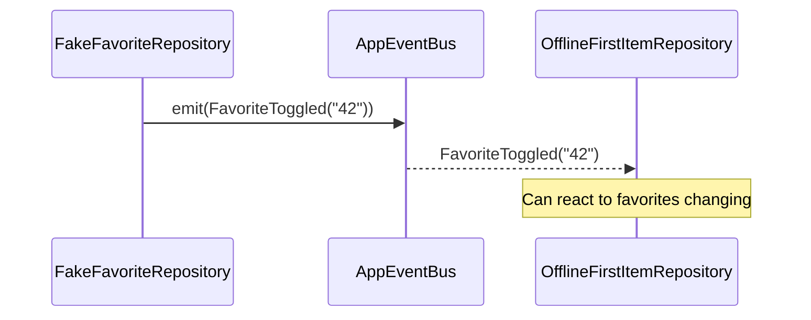

### Events

```kotlin
sealed interface AppEvent {
    data class FavoriteToggled(val itemId: String) : AppEvent
    data object ItemsUpdated : AppEvent
}
```

### AppEventBus

```kotlin
interface AppEventBus {
    val events: SharedFlow<AppEvent>
    suspend fun emit(event: AppEvent)
}
```

The implementation uses a `MutableSharedFlow` with extra buffer capacity for fire-and-forget semantics. It's registered as a singleton in Koin and injected into any module that needs cross-feature communication.

---

## Database + API Sync

The **offline-first** pattern uses Room as a local cache with API as the source of truth. The database module (`infrastructure:database`) provides DAOs and entities, while feature data modules implement the sync strategy.

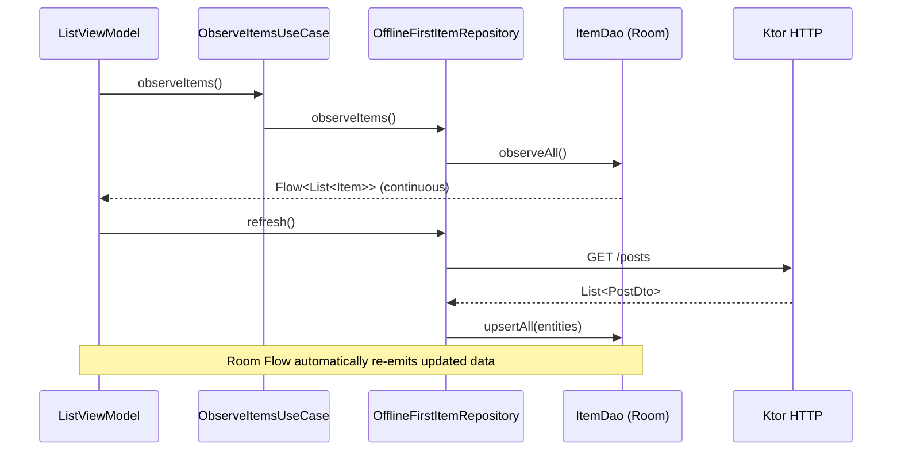

### Key patterns

- **`observeItems()`** returns a `Flow` from Room that never completes — UI receives updates automatically when the database changes
- **`refresh()`** fetches from the API and upserts into Room — the observable Flow handles propagation
- **`getItems()` / `getItem()`** are one-shot suspend functions that read from the DAO directly

---

## Observable vs One-Shot Use Cases

The project uses two patterns for use cases, each as a `fun interface`:

### One-shot use cases (fetch once)

```kotlin
fun interface GetItemsUseCase {
    operator fun invoke(): Flow<List<Item>>  // completes after single emission
}

// Implementation uses flowSingle { } — emits once and completes
internal class GetItemsUseCaseImpl(
    private val repository: ItemRepository,
) : GetItemsUseCase {
    override fun invoke() = flowSingle {
        repository.getItems().sortedBy { it.title }
    }
}
```

### Observable use cases (continuous stream)

```kotlin
fun interface ObserveItemsUseCase {
    operator fun invoke(): Flow<List<Item>>  // never completes — emits on every change
}

// Implementation delegates to repository's Flow (backed by Room)
internal class ObserveItemsUseCaseImpl(
    private val repository: ItemRepository,
) : ObserveItemsUseCase {
    override fun invoke() = repository.observeItems()
}
```

### Refresh use case (trigger sync)

```kotlin
fun interface RefreshItemsUseCase {
    operator fun invoke(): Flow<Unit>  // one-shot: triggers API fetch + DB upsert
}
```

### ViewModel usage

```kotlin
// Observe continuously — never completes, UI always up to date
observeItems()
    .onEach { items -> _uiState.update { it.copy(items = items) } }
    .launchWith(viewModelScope) { ... }

// Trigger refresh — one-shot, manages loading state
refreshItems()
    .onStart { _uiState.update { it.copy(isLoading = true) } }
    .onEach { _uiState.update { it.copy(isLoading = false) } }
    .launchWith(viewModelScope) { ... }
```

---

## MVI Pattern

Each screen follows the **Model-View-Intent** pattern with an explicit contract.

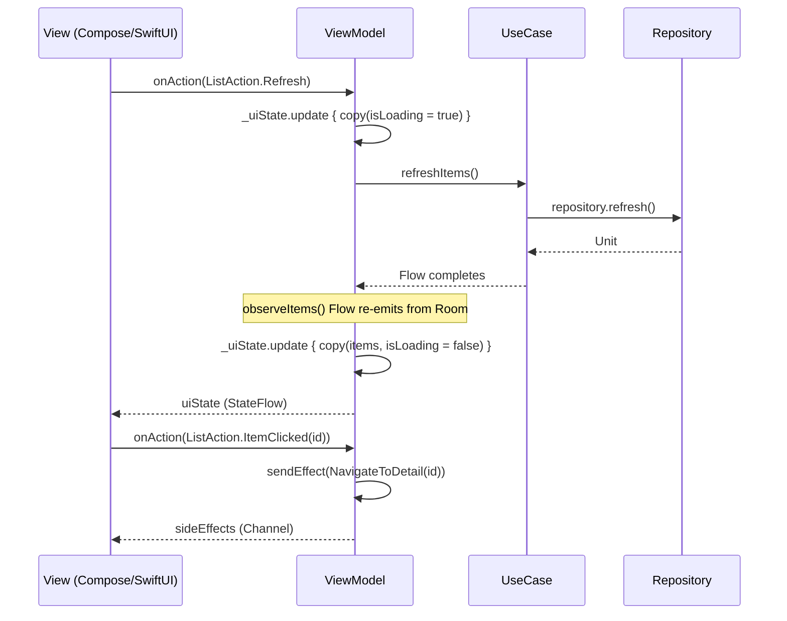

### MVI Contract Structure

Every screen defines a **triple** of `State`, `Action`, and `SideEffect`:

```kotlin
// State — the current UI state (immutable data class)
data class ListState(
    val items: List<Item> = emptyList(),
    val isLoading: Boolean = false,
    val error: String? = null,
)

// Action — user intents (sealed interface)
sealed interface ListAction {
    data object Refresh : ListAction
    data class ItemClicked(val itemId: String) : ListAction
}

// SideEffect — one-shot events like navigation (sealed interface)
sealed interface ListSideEffect {
    data class NavigateToDetail(val itemId: String) : ListSideEffect
}
```

### BaseViewModel

All ViewModels extend `BaseViewModel<State, Action, SideEffect>`:

```kotlin
abstract class BaseViewModel<S : Any, A, E> : ViewModel() {
    protected abstract val _uiState: MutableStateFlow<S>
    val uiState: StateFlow<S>          // Observed by the View
    val sideEffects: Flow<E>           // Collected by the View for navigation/effects
    abstract fun onAction(action: A)   // Single entry point for all user intents
    protected fun sendEffect(effect: E)
}
```

This ensures **unidirectional data flow**: View dispatches Actions, ViewModel produces State and SideEffects.

---

## SOLID Principles

### Single Responsibility (SRP)

Each module and class has exactly one reason to change:

| Class | Single Responsibility |
|-------|----------------------|
| `ObserveItemsUseCaseImpl` | Continuous item observation from database |
| `RefreshItemsUseCaseImpl` | Triggers API fetch and database sync |
| `GetItemUseCaseImpl` | Combines item data with favorite status |
| `OfflineFirstItemRepository` | Coordinates API, database, and events for items |
| `ListViewModel` | Manages list screen MVI state machine |
| `safeApiCall` | Maps HTTP exceptions to domain exceptions |

### Open/Closed Principle (OCP)

- New features are added by creating new modules — no existing code is modified
- The `CastociastoException` sealed hierarchy is extensible with new exception categories
- New use cases implement existing `fun interface` contracts without changing consumers
- New `AppEvent` subtypes can be added to the sealed interface without modifying existing handlers

### Liskov Substitution (LSP)

- `FakeCategoryRepository` and `FakeFavoriteRepository` are drop-in substitutes for real implementations
- Test fakes (`FakeItemRepository`) substitute production repositories without behavioral differences
- All repository implementations honor the contracts defined in `core` interfaces

### Interface Segregation (ISP)

- Use cases are defined as **single-method functional interfaces** (`fun interface`):
  ```kotlin
  fun interface ObserveItemsUseCase {
      operator fun invoke(): Flow<List<Item>>
  }
  ```
- Repositories expose only the methods needed by their consumers
- Core modules contain only interfaces and models — no implementation baggage

### Dependency Inversion (DIP)

UI and Data depend on **abstractions defined in Domain**. Domain depends on Core for shared models and repository interfaces. No layer knows about another's implementations. See the [Dependency Inversion](#dependency-inversion) section for details.

---

## Dependency Inversion

**Domain** owns use case interfaces. **Core** owns shared models and repository interfaces. UI and Data depend on Domain (and Core for models). None of them know about each other's implementations.

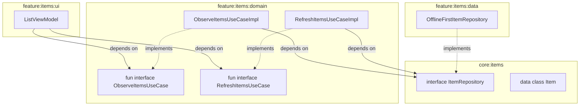

### How it works in practice

1. **Core** defines shared models and cross-feature repository interfaces:
   ```kotlin
   // shared/core/items — shared models + repository contract
   data class Item(val id: String, val title: String, val subtitle: String, val isFavorite: Boolean = false)

   interface ItemRepository {
       suspend fun getItems(): List<Item>
       suspend fun getItem(id: String): Item?
       fun observeItems(): Flow<List<Item>>
       fun observeItem(id: String): Flow<Item?>
       suspend fun refresh()
   }
   ```

2. **Domain** defines use case interfaces and provides implementations:
   ```kotlin
   // shared/feature/items/domain — use case interfaces (public)
   fun interface ObserveItemsUseCase {
       operator fun invoke(): Flow<List<Item>>
   }
   fun interface RefreshItemsUseCase {
       operator fun invoke(): Flow<Unit>
   }

   // shared/feature/items/domain — implementations (internal)
   internal class ObserveItemsUseCaseImpl(
       private val repository: ItemRepository,
   ) : ObserveItemsUseCase { ... }
   ```

3. **UI** depends on Domain for use case interfaces:
   ```kotlin
   class ListViewModel(
       private val observeItems: ObserveItemsUseCase,
       private val refreshItems: RefreshItemsUseCase,
   ) : BaseViewModel<ListState, ListAction, ListSideEffect>() { ... }
   ```

4. **Data** depends on Domain (and Core) for repository interfaces:
   ```kotlin
   internal class OfflineFirstItemRepository(
       private val httpClient: HttpClient,
       private val itemDao: ItemDao,
       private val eventBus: AppEventBus,
   ) : ItemRepository { ... }
   ```

5. **Koin** wires it all together at runtime:
   ```kotlin
   val itemsDataModule = module {
       single<ItemRepository> { OfflineFirstItemRepository(get(), get(), get()) }
   }
   val itemsDomainModule = module {
       factory<ObserveItemsUseCase> { ObserveItemsUseCaseImpl(get()) }
       factory<RefreshItemsUseCase> { RefreshItemsUseCaseImpl(get()) }
   }
   val itemsUiModule = module {
       viewModelOf(::ListViewModel)
   }
   ```

6. **Gradle plugins** enforce these boundaries at compile time — `ui` cannot import `data`, `data` cannot import `ui`, `core` cannot import Koin or Ktor.

---

## Exception Handling

Errors are modeled as a **sealed exception hierarchy** that flows from the infrastructure layer up through domain to the UI.

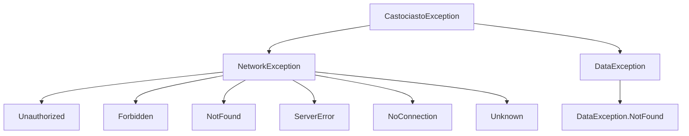

### Error Flow Through Layers

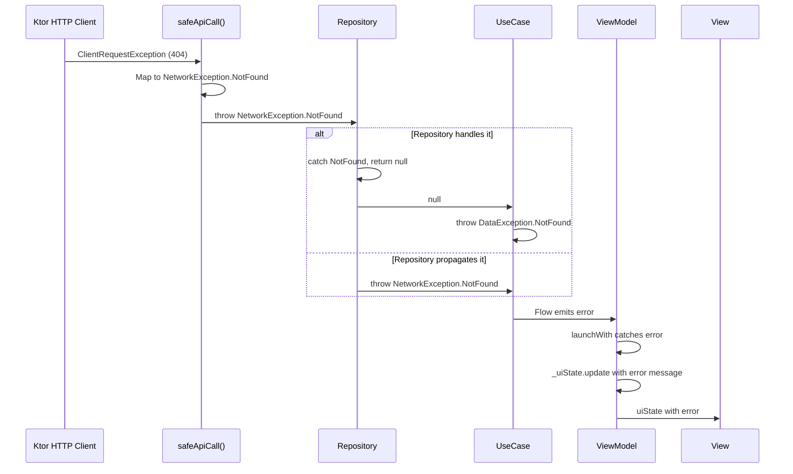

### Layer-by-layer error handling

**1. Infrastructure** — `safeApiCall()` maps all HTTP/network errors to typed domain exceptions:
```kotlin
suspend fun <T> safeApiCall(block: suspend () -> T): T {
    return try { block() }
    catch (e: CancellationException) { throw e }          // Never swallow cancellation
    catch (e: CastociastoException) { throw e }            // Already typed — re-throw
    catch (e: ClientRequestException) {                     // HTTP 4xx
        throw when (e.response.status.value) {
            401 -> NetworkException.Unauthorized
            403 -> NetworkException.Forbidden
            404 -> NetworkException.NotFound
            else -> NetworkException.Unknown(e.message)
        }
    }
    catch (e: ServerResponseException) { throw NetworkException.ServerError(e.message) }
    catch (e: Exception) { throw NetworkException.NoConnection(e.message ?: "Connection failed") }
}
```

**2. Data** — Repositories call `safeApiCall()` and sync to the database:
```kotlin
override suspend fun refresh() {
    val posts = safeApiCall { httpClient.get("posts").body<List<PostDto>>() }
    itemDao.upsertAll(posts.map { it.toEntity() })
    eventBus.emit(AppEvent.ItemsUpdated)
}
```

**3. Domain** — Use cases may throw new domain exceptions:
```kotlin
val item = itemRepository.getItem(id)
    ?: throw CastociastoException.DataException.NotFound("Item $id not found")
```

**4. UI** — ViewModels catch errors via `launchWith()` extension and map to UI state:
```kotlin
refreshItems()
    .onStart { _uiState.update { it.copy(isLoading = true) } }
    .onEach { _uiState.update { it.copy(isLoading = false) } }
    .launchWith(viewModelScope) { error ->
        _uiState.update { it.copy(isLoading = false, error = error.message) }
    }
```

---

## Dependency Injection

**Koin** is used as the DI framework. Each layer registers its own module. Koin is the only place where implementations are linked to interfaces — the rest of the code only knows about abstractions.

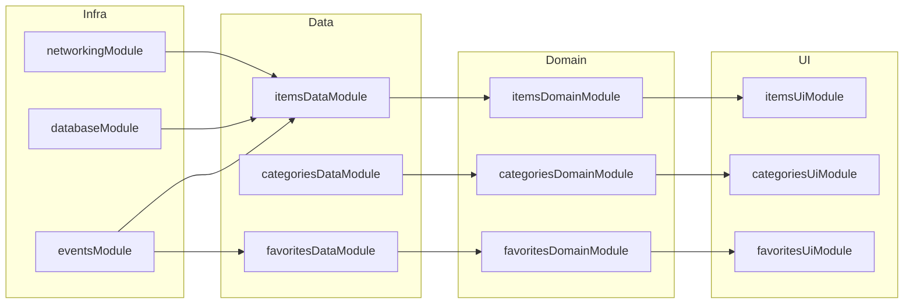

All modules are aggregated in `shared/app`:
```kotlin
val appModules = listOf(
    networkingModule, databaseModule, eventsModule,
    itemsDataModule, itemsDomainModule, itemsUiModule,
    categoriesDataModule, categoriesDomainModule, categoriesUiModule,
    favoritesDataModule, favoritesDomainModule, favoritesUiModule,
)
```

---

## Build Convention Plugins

Custom Gradle plugins in `build-logic/convention/` enforce architectural boundaries at compile time. Each layer gets only the dependencies it needs — nothing more.

| Plugin | Applied To | Provides | Restricts |
|--------|-----------|----------|-----------|
| `castociasto.kmp.library` | All shared modules | KMP base setup | No framework dependencies |
| `castociasto.kmp.api` | `core/*` | Coroutines | No Koin, no Ktor, no Lifecycle |
| `castociasto.kmp.domain` | `feature/*/domain` | Coroutines, Koin | No Ktor, no Lifecycle |
| `castociasto.kmp.data` | `feature/*/data` | Coroutines, Koin | No Lifecycle |
| `castociasto.kmp.ui` | `feature/*/ui` | Coroutines, Koin, Lifecycle, ViewModel | — |
| `castociasto.kmp.infra` | `infrastructure/*` | Ktor, Serialization, Koin | No Lifecycle |

This means a `core` module **physically cannot** import Koin or Ktor — the dependency simply isn't on the classpath. A `domain` module cannot import Ktor. These boundaries are enforced by the build system, not by convention.

---

## Testing Strategy

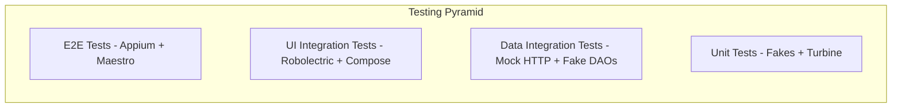

| Layer | Test Type | Approach |
|-------|-----------|----------|
| **Core** | Unit tests | Event bus emission/subscription with Turbine |
| **Domain** | Unit tests | Fake repositories, Turbine for Flow assertions |
| **Data** | Integration tests | Ktor `MockEngine` + Fake DAOs for offline-first testing |
| **UI (unit)** | ViewModel tests | Fake use cases, MVI state/effect assertions |
| **UI (integration)** | Robolectric + Compose | Fake repositories, real use cases + ViewModels, full UI rendering |
| **E2E (Appium)** | End-to-end | Kotlin + Page Objects, Appium + UiAutomator2 / XCUITest |
| **E2E (Maestro)** | End-to-end | YAML flows, Maestro CLI, cross-platform via accessibility IDs |

This project includes **both Appium and Maestro** E2E test suites covering the same 6 user journeys, allowing direct comparison. See [Appium vs Maestro Comparison](#appium-vs-maestro-comparison) for benchmarks and trade-offs.

### E2E Testing with Appium

End-to-end tests live in the `e2e/` module and use **Appium** to automate both Android and iOS apps on emulators/simulators or real devices.

#### Compose + Appium: `testTag` as `resource-id`

Jetpack Compose elements are invisible to UiAutomator by default. To make them discoverable:

1. **Enable `testTagsAsResourceId`** once at the root composable (in `MainActivity`):
   ```kotlin
   Box(modifier = Modifier.semantics { testTagsAsResourceId = true }) {
       CastociastoNavHost()
   }
   ```

2. **Add `testTag` to composables** you want to locate in tests:
   ```kotlin
   Scaffold(modifier = Modifier.testTag("list_screen")) { ... }
   LazyColumn(modifier = Modifier.testTag("items_list")) { ... }
   Text("Castociasto", modifier = Modifier.semantics { testTag = "list_title" })
   ```

3. **Find elements in Appium** via `By.id("testTag")`:
   ```kotlin
   driver.findElement(By.id("list_screen"))     // resource-id = "list_screen"
   driver.findElement(By.id("items_list"))       // resource-id = "items_list"
   ```

| Compose API | UiAutomator attribute | Appium locator |
|---|---|---|
| `Modifier.testTag("x")` | `resource-id = "x"` | `By.id("x")` |
| `Icon(contentDescription = "Back")` | `content-desc = "Back"` | `AppiumBy.accessibilityId("Back")` |
| `Text("visible text")` | `text = "visible text"` | `By.xpath("//..[@text='visible text']")` |

#### SwiftUI + Appium: `accessibilityIdentifier` as `name`

SwiftUI elements are located via `accessibilityIdentifier`, which maps to the XCUITest `name` attribute:

1. **Add `.accessibilityIdentifier()` to views** you want to locate in tests:
   ```swift
   List(items) { ... }
       .accessibilityElement(children: .contain)
       .accessibilityIdentifier("items_list")
   Text(item.title)
       .accessibilityIdentifier("detail_title")
   ```

2. **Find elements in Appium** via `AppiumBy.accessibilityId()`:
   ```kotlin
   driver.findElement(AppiumBy.accessibilityId("items_list"))
   driver.findElement(AppiumBy.accessibilityId("detail_title"))
   ```

| SwiftUI API | XCUITest attribute | Appium locator |
|---|---|---|
| `.accessibilityIdentifier("x")` | `name = "x"` | `AppiumBy.accessibilityId("x")` |
| `Button("Back")` | `name = "Back"` | `AppiumBy.accessibilityId("Back")` |

> **Gotcha:** SwiftUI `Group` is a transparent container — `.accessibilityIdentifier()` on a `Group` propagates to all its children, overriding their own identifiers. Use `.accessibilityElement(children: .contain)` on the actual content view to create a proper accessibility container that preserves child identifiers.

#### Appium capabilities

Two capabilities are critical for Compose:

- **`disableIdLocatorAutocompletion = true`** — prevents Appium from prefixing `resource-id` with the package name (Compose `testTag` sets raw strings, not `package:id/tag`)
- **`forceAppLaunch = true`** — restarts the app for each test so it always starts on the list screen

#### Page Object pattern

Tests use the **Page Object Model** — each screen has a page class that encapsulates locators and actions:

```
e2e/src/test/kotlin/.../e2e/
├── base/BaseE2ETest.kt        # Driver setup, capabilities, teardown
├── config/AppiumConfig.kt     # Server URL, timeouts, APK path
├── page/
│   ├── ListPage.kt            # waitForItemsToLoad(), tapFirstItem(), isDisplayed()
│   └── DetailPage.kt          # waitForContent(), tapBack(), isDisplayed()
└── test/ItemsFlowE2ETest.kt   # 6 user journey tests
```

Page methods return page objects for fluent chaining:
```kotlin
listPage.waitForItemsToLoad()
    .tapFirstItem()           // returns DetailPage
    .waitForContent()
    .tapBack()                // returns ListPage
    .waitForItemsToLoad()
```

#### Running E2E tests

See [Getting Started](#getting-started) for full environment setup. Quick run:

```bash
# Terminal 1: start Appium server
appium

# Terminal 2: run tests (emulator must be connected)
./gradlew :e2e:test
```

If Appium server is not running, E2E tests are skipped automatically (not failed).

### E2E Testing with Maestro

**Maestro** is a declarative, YAML-based mobile UI testing tool. Flows live in `.maestro/` and use the same accessibility identifiers (`testTag` on Android, `accessibilityIdentifier` on iOS) as the Appium tests.

#### Setup

```bash
curl -Ls "https://get.maestro.mobile.dev" | bash
export PATH="$PATH:$HOME/.maestro/bin"
maestro --version
```

#### Flow structure

```
.maestro/
├── 01_app_launches_and_shows_list.yaml
├── 02_list_displays_items.yaml
├── 03_tap_item_shows_detail.yaml
├── 04_back_navigation_returns_to_list.yaml
├── 05_successful_load_no_error.yaml
└── 06_different_items_show_different_content.yaml
```

Each flow is a standalone YAML file — no server, no page objects, no build step:

```yaml
# 03_tap_item_shows_detail.yaml
appId: ${APP_ID}
---
- launchApp
- assertVisible:
    id: "items_list"
- extendedWaitUntil:
    visible:
      id: "item_.*"
    timeout: 5000
- tapOn:
    id: "item_.*"
    index: 0
- assertVisible:
    id: "detail_title"
- assertVisible:
    id: "detail_subtitle"
```

#### Running Maestro tests (Android)

1. Start an Android emulator
2. Install the app:
   ```bash
   ./gradlew :androidApp:assembleDebug
   adb install androidApp/build/outputs/apk/debug/androidApp-debug.apk
   ```
3. Run:
   ```bash
   maestro test -e APP_ID=pl.rockit.castociasto .maestro/
   ```

#### Running Maestro tests (iOS)

1. Boot and open a simulator:
   ```bash
   xcrun simctl boot "iPhone 17 Pro"
   open -a Simulator
   ```
2. Build and install the app:
   ```bash
   xcodebuild -project iosApp/iosApp.xcodeproj -scheme iosApp \
     -sdk iphonesimulator -configuration Debug -derivedDataPath iosApp/build build
   xcrun simctl install booted iosApp/build/Build/Products/Debug-iphonesimulator/Castociasto.app
   ```
3. Run:
   ```bash
   maestro test -e APP_ID=pl.rockit.castociasto.Castociasto .maestro/
   ```

#### Cross-platform compatibility

Maestro flows work on both platforms without modification because:
- **Element lookup** uses `id:` which maps to `resource-id` (Android testTag) and `accessibilityIdentifier` (iOS) automatically
- **Regex matching** (`id: "item_.*"`) finds dynamic elements on both platforms
- **Back navigation** taps the "Back" accessibility label (present on both platforms) instead of using the Android system back button

---

## Appium vs Maestro Comparison

Both test suites cover the same 6 user journeys. Here's how they compare, measured on this project:

### Benchmark Results (Android, same emulator, same tests)

| Metric | Appium | Maestro |
|--------|--------|---------|
| **Total suite time** | ~68s | ~41s |
| **App launch + list check** | 8.8s | 4s |
| **List displays items** | 8.7s | 5s |
| **Tap item shows detail** | 18.0s | 6s |
| **Back navigation** | 10.1s | 10s |
| **No error on success** | 8.8s | 5s |
| **Different items** | 12.0s | 11s |

### Setup Comparison

| | Appium | Maestro |
|---|---|---|
| **Install** | `npm install -g appium` + drivers | `curl -Ls "https://get.maestro.mobile.dev" \| bash` |
| **Server required** | Yes (`appium` must be running) | No |
| **Test language** | Kotlin/Java/Python/JS/any | YAML |
| **Lines of test code** | 424 (7 Kotlin files) | 103 (6 YAML files) |
| **Page objects needed** | Yes (recommended) | No |
| **Build step for tests** | Yes (Gradle compiles Kotlin) | No |
| **Time to first test** | ~5 min (install + drivers + server + write test) | ~1 min (install + write YAML) |

### Pros and Cons

#### Appium

| Pros | Cons |
|------|------|
| Full programming language — loops, variables, conditionals, custom assertions | Requires Appium server running separately |
| Page Object pattern for maintainable, reusable code | More boilerplate (driver setup, capabilities, locators, waits) |
| Supports complex gestures, system-level interactions, hybrid apps | Slower — HTTP round-trip per command |
| Huge ecosystem — works with any test framework (JUnit, TestNG, pytest) | Flaky by nature — needs explicit waits, retry logic |
| Can run against real devices, cloud providers (BrowserStack, Sauce Labs) | Platform-specific locator strategies needed |
| Extensible via plugins and custom drivers | Heavy setup for CI (server, drivers, environment variables) |

#### Maestro

| Pros | Cons |
|------|------|
| Zero infrastructure — no server, no drivers, just CLI | YAML only — no loops, limited conditionals |
| Built-in automatic waiting — far less flakiness | Can't do complex gestures or system-level interactions |
| ~4x less code for the same test coverage | Regex-based element matching only (no XPath, no CSS selectors) |
| Same YAML flows work on both Android and iOS | Newer tool, smaller community |
| Fast iteration — edit YAML, re-run immediately | No Page Object pattern (each flow is standalone) |
| Maestro Cloud for easy CI | Can't assert on exact text equality across elements |
| Built-in screenshot/video recording | Limited to mobile (no desktop/web hybrid) |

### When to Use Which

| Scenario | Recommendation |
|----------|---------------|
| Quick smoke tests for CI | Maestro |
| Rapid prototyping of test flows | Maestro |
| Complex multi-step workflows with logic | Appium |
| System-level testing (permissions, settings, notifications) | Appium |
| Cloud device farms (BrowserStack, Sauce Labs) | Appium |
| Team with limited test automation experience | Maestro |
| Cross-platform happy-path regression | Maestro |
| Custom gesture testing (drag, pinch, long press sequences) | Appium |

### Using Both Together

This project demonstrates the recommended approach: **use both side by side**.

- **Maestro** covers the core user journeys (launch, browse, navigate, error states) — fast, reliable, easy to maintain
- **Appium** handles edge cases that need programmatic control — complex assertions, cross-element comparisons, system interactions

The same accessibility identifiers (`testTag` / `accessibilityIdentifier`) power both frameworks, so adding a new test to either is straightforward.

---

## How to Add a New Feature

Follow these steps to add a new feature module (e.g. `orders`) that follows the same architecture:

### 1. Create core contracts

Create `shared/core/orders/` with the convention plugin `castociasto.kmp.api`:

```kotlin
// shared/core/orders/src/commonMain/.../core/orders/model/Order.kt
data class Order(val id: String, val name: String, val total: Double)

// shared/core/orders/src/commonMain/.../core/orders/repository/OrderRepository.kt
interface OrderRepository {
    suspend fun getOrders(): List<Order>
    fun observeOrders(): Flow<List<Order>>
    suspend fun refresh()
}
```

### 2. Create domain layer

Create `shared/feature/orders/domain/` with `castociasto.kmp.domain`:

```kotlin
// Use case interface (public)
fun interface GetOrdersUseCase {
    operator fun invoke(): Flow<List<Order>>
}

// Implementation (internal)
internal class GetOrdersUseCaseImpl(
    private val repository: OrderRepository,
) : GetOrdersUseCase {
    override fun invoke() = flowSingle { repository.getOrders() }
}

// Koin module
val ordersDomainModule = module {
    factory<GetOrdersUseCase> { GetOrdersUseCaseImpl(get()) }
}
```

### 3. Create data layer

Create `shared/feature/orders/data/` with `castociasto.kmp.data`. Implement the repository and register it in Koin:

```kotlin
internal class OfflineFirstOrderRepository(
    private val httpClient: HttpClient,
    private val orderDao: OrderDao,
) : OrderRepository { ... }

val ordersDataModule = module {
    single<OrderRepository> { OfflineFirstOrderRepository(get(), get()) }
}
```

### 4. Create UI layer

Create `shared/feature/orders/ui/` with `castociasto.kmp.ui`. Define the MVI contract and ViewModel:

```kotlin
data class OrdersState(val orders: List<Order> = emptyList(), val isLoading: Boolean = false, val error: String? = null)
sealed interface OrdersAction { data object Load : OrdersAction }
sealed interface OrdersSideEffect { ... }

class OrdersViewModel(private val getOrders: GetOrdersUseCase)
    : BaseViewModel<OrdersState, OrdersAction, OrdersSideEffect>() { ... }
```

### 5. Register modules

Add all three modules to `settings.gradle.kts`:
```kotlin
include(":shared:core:orders")
include(":shared:feature:orders:domain")
include(":shared:feature:orders:data")
include(":shared:feature:orders:ui")
```

Add Koin modules to `shared/app`:
```kotlin
val appModules = listOf(
    ...,
    ordersDataModule, ordersDomainModule, ordersUiModule,
)
```

### 6. Add tests

- **Domain**: Unit test each use case with a fake repository
- **UI (unit)**: ViewModel test with fake use cases (follow `ListScreenTest` pattern)
- **UI (integration)**: Robolectric test with fake repositories wired through real use cases via Koin (follow `ListScreenIntegrationTest` pattern)
- **Data**: Integration test with `MockEngine` + fake DAO

### 7. Add platform screens

- **Android**: Compose screen in `androidApp/` using `koinViewModel()`
- **iOS**: SwiftUI view in `iosApp/` using `KoinHelper`

---

## Getting Started

### 1. Install JDK 17+

```bash
brew install openjdk@17
sudo ln -sfn /opt/homebrew/opt/openjdk@17/libexec/openjdk.jdk /Library/Java/JavaVirtualMachines/openjdk-17.jdk
```

### 2. Environment variables

Add **all** of the following to `~/.zshrc` (copy-paste the entire block):

```bash
cat >> ~/.zshrc << 'EOF'

# Java
export JAVA_HOME=/opt/homebrew/opt/openjdk@17/libexec/openjdk.jdk/Contents/Home

# Android SDK (required by Appium and adb)
export ANDROID_HOME=$HOME/Library/Android/sdk
export PATH="$PATH:$ANDROID_HOME/platform-tools"
export PATH="$PATH:$ANDROID_HOME/emulator"
EOF
```

Then apply and verify:
```bash
source ~/.zshrc
java -version    # should show 17+
echo $ANDROID_HOME  # should show /Users/<you>/Library/Android/sdk
adb devices      # should list connected devices/emulators
```

> **Important:** After editing `~/.zshrc`, close and reopen **all** terminal tabs — or run `source ~/.zshrc` in each open tab. Appium must be started in a terminal that has `ANDROID_HOME` set.

### 3. Build and run unit tests

```bash
./gradlew testDebugUnitTest
```

### 4. E2E tests (Appium)

#### One-time setup

```bash
npm install -g appium
appium driver install uiautomator2   # Android
appium driver install xcuitest       # iOS
```

#### Run E2E tests (Android)

1. Start an Android emulator (Android Studio -> Device Manager)
2. Build the debug APK:
   ```bash
   ./gradlew :androidApp:assembleDebug
   ```
3. Start Appium server in a separate terminal:
   ```bash
   appium
   ```
4. Run the tests:
   ```bash
   ./gradlew :e2e:test
   ```

#### Run E2E tests (iOS)

1. Boot an iOS simulator:
   ```bash
   xcrun simctl boot "iPhone 17 Pro"
   open -a Simulator
   ```
   > **Tip:** Run `xcrun simctl list devices available` to see simulator names on your machine.

2. **(Corporate proxy only)** If behind Zscaler or similar TLS-intercepting proxy, install the root CA on the simulator:
   ```bash
   security find-certificate -a -p -c "Zscaler Root CA" /Library/Keychains/System.keychain > /tmp/zscaler.pem
   xcrun simctl keychain booted add-root-cert /tmp/zscaler.pem
   ```
3. Build the iOS app:
   ```bash
   xcodebuild -project iosApp/iosApp.xcodeproj -scheme iosApp -sdk iphonesimulator -configuration Debug -derivedDataPath iosApp/build build
   ```
4. Start Appium server in a separate terminal:
   ```bash
   appium
   ```
5. Run the tests:
   ```bash
   PLATFORM=ios ./gradlew :e2e:test
   ```
   or equivalently via Gradle system property:
   ```bash
   ./gradlew :e2e:test -Dplatform=ios
   ```

   Optional env var overrides:
   ```bash
   IOS_DEVICE_NAME="iPhone 17 Pro" IOS_PLATFORM_VERSION="26.3" APP_PATH="/path/to/iosApp.app" PLATFORM=ios ./gradlew :e2e:test
   ```

> **Note:** Always run E2E tests from the **terminal** — Android Studio's test runner may show "Test events were not received" for Appium tests. If tests appear cached (instant "BUILD SUCCESSFUL"), add `--rerun` to force re-execution.

### 5. E2E tests (Maestro)

#### One-time setup

```bash
curl -Ls "https://get.maestro.mobile.dev" | bash
export PATH="$PATH:$HOME/.maestro/bin"
```

#### Run Maestro tests (Android)

1. Start an Android emulator
2. Build and install:
   ```bash
   ./gradlew :androidApp:assembleDebug
   adb install androidApp/build/outputs/apk/debug/androidApp-debug.apk
   ```
3. Run:
   ```bash
   maestro test -e APP_ID=pl.rockit.castociasto .maestro/
   ```

#### Run Maestro tests (iOS)

1. Boot a simulator:
   ```bash
   xcrun simctl boot "iPhone 17 Pro"
   open -a Simulator
   ```
2. Build and install:
   ```bash
   xcodebuild -project iosApp/iosApp.xcodeproj -scheme iosApp \
     -sdk iphonesimulator -configuration Debug -derivedDataPath iosApp/build build
   xcrun simctl install booted iosApp/build/Build/Products/Debug-iphonesimulator/Castociasto.app
   ```
3. Run:
   ```bash
   maestro test -e APP_ID=pl.rockit.castociasto.Castociasto .maestro/
   ```

---

## Tech Stack

| Category | Technology |
|----------|-----------|
| **Language** | Kotlin 2.x (Multiplatform) |
| **Android UI** | Jetpack Compose |
| **iOS UI** | SwiftUI |
| **Architecture** | Clean Architecture + MVI |
| **Networking** | Ktor |
| **Database** | Room (KMP) |
| **Serialization** | kotlinx.serialization |
| **DI** | Koin |
| **Async** | Kotlin Coroutines + Flow |
| **ViewModel** | AndroidX Lifecycle (multiplatform) |
| **Swift interop** | SKIE (sealed types, flows in SwiftUI) |
| **Testing** | kotlin.test, Turbine, Ktor MockEngine, Robolectric |
| **E2E Testing** | Appium, Maestro |
| **CI** | GitHub Actions |
| **Build** | Gradle with convention plugins |
